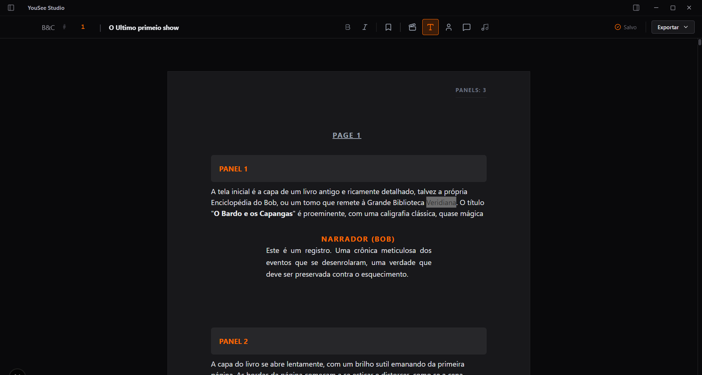

# 👁️ YouSee - HQ Script Editor


**O YouSee é um editor de roteiros de histórias em quadrinhos profissional, Open Source, focado em alta performance e uma experiência visual imersiva "Dark Mode".**

Desenvolvido para resolver o problema de formatação de roteiros de HQ, oferecendo uma interface limpa que separa a Página da História da Folha de Impressão.


*(Substitua este caminho pela sua imagem real)*

---

## ✨ Funcionalidades Principais

### 📚 Organização de Séries
- **Dashboard visual** para gerenciar múltiplos roteiros.
- **Agrupamento automático** por Série e ordenação por Capítulo.
- Identidade visual "Dark & Amber" consistente.

### 🧠 Autocomplete Inteligente
- Sugestão automática de nomes de **Personagens recorrentes** (@ ou digitação).
- Autocomplete para nomes de **Séries já existentes**.

### 📝 Formatação de Roteiro (Comic Script)
- Blocos semânticos para **Painéis (Cenas), Personagens, Diálogos e SFX**.
- Numeração inteligente: `PAGE X` - `PANELS: Y`.

### 📄 Engine de Paginação Automática
- Detecta quando o conteúdo excede o tamanho A4 e cria novas páginas automaticamente.
- **WYSIWYG:** O que você vê na tela é exatamente o que sai no PDF.

### 💾 Persistência Local-First
- Salvamento automático e robusto no `localStorage`.
- **Privacidade total:** seus dados nunca saem do seu navegador.

### 🖨️ Exportação PDF Profissional (Engine Própria)
- **Modo Padrão (Industry Standard):** Fonte Courier Prime 12pt, margens de cinema, fundo branco (pronto para imprimir/enviar para editoras).
- **Modo YouSee (Dark Mode):** PDF otimizado para leitura digital em tablets/celulares, com fundo escuro e alto contraste.
- Geração *Client-Side* rápida sem depender de API externa.

---

## 🛠️ Stack Tecnológica

- **Core:** Next.js 14 (App Router)
- **Linguagem:** TypeScript (Strict Mode)
- **Estilo:** Tailwind CSS (com CSS Variables)
- **Editor Engine:** Tiptap (Headless ProseMirror)
- **PDF Engine:** @react-pdf/renderer
- **State Management:** React Hooks + LocalStorage
- **Icons:** Lucide React

---

## 🚀 Como Rodar Localmente

1. **Clone o repositório:**
   ```bash
   git clone https://github.com/rossydDev/YouSee-Editor.git
   ```

2. **Instale as dependências:**
   ```bash
   npm run dev
   ```

2. **Rode o servidor de desenvolvimento:**
   ```bash
   npm run dev
   ```

4. Abra http://localhost:3000 no seu navegador.

🤝 Contribuição

Contribuições são bem-vindas! Sinta-se à vontade para abrir Issues relatando bugs ou enviar Pull Requests com melhorias.

<p align="center"> Desenvolvido com 🧡 e café. </p>